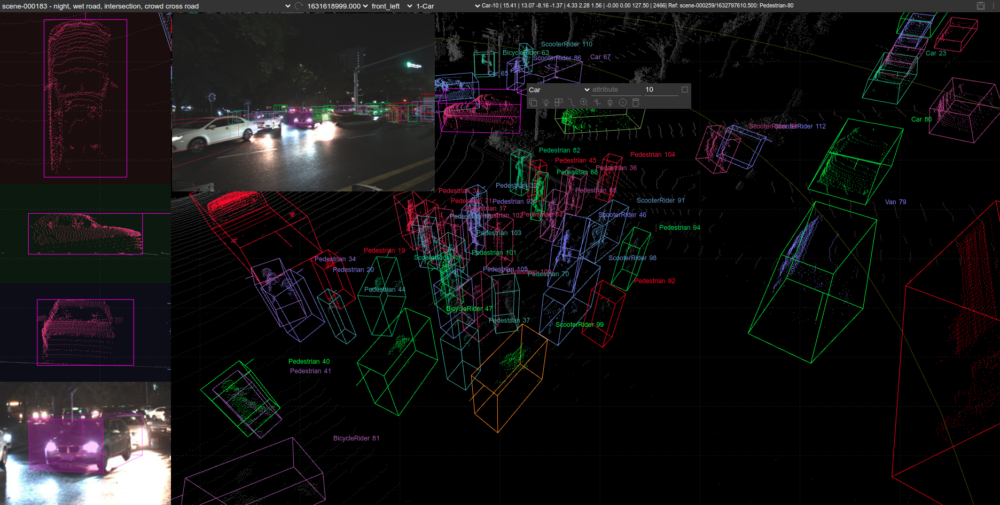

# Point Cloud 3D Bounding Box Annotation Tool




## Features

- 9 DoF box editing
- edit on perspective view and projective view
- camera image as context
- camera image and LiDAR point cloud fusion if extrinsic info is given
- focus target object in image if extrinsic info is given
- binary/ascii pcd files and all format image files
- multi-camera images
- auto image follow if extrinsic transformation information is given
- semi-auto box annotation (details later)
- objects/boxes color by category
- focus mode to hide background to check details easily
- stream play/stop
- auto object tracking id generation


## Requirements

python, cherrypy

## install
pip install cherrypy

## Start
run the following script in shell, then go to http://127.0.0.1:8081
```
python main.py
```

## Data preparation

````
public
   +- data
       +- scene1
             +- image
                  +- front
                       +- 0000.jpg
                       +- 0001.jpg
                  +- left
                       +- ...
             +- pcd
                  +- 0000.pcd
                  +- 0001.pcd
             +- label
                  +- 0000.json
             +- calib
                  +- front.json
                  +- left.json
                  +- ...
       +- scene2
             
````

label is the directory to save the annotation result.

calib is the calibration matrix from point cloud to image. it's optional, but if provided, the box is projected on the image so as to assist the annotation.

check examples in `./data/example`

## object type configuration

## Operations

```
mouse scroll up/down:  zoom in/out
mouse left key hold/move: rotate (change main view)
mouse right key hold/move: pan

left click on a box: select
left click on a selected box: show transform control
left click on non-box area: hide transform control if present, or unselect box

when transform control if present:
v: switch transform modes among resize/translate/rotate
z/x/c: turan on/off x/y/z axis
use mouse to adjust the box.


in side view (projective view):

a: move box left
s: move box down
d: move box right
w: move box up
q: rotate box counterclockwise
e: rotate box clockwise
r: rotate box counterclockwise, with box auto-fitting
f: rotate box clockwise, with box auto-fitting

double click on center: auto-shrink box by adjusting all borders to nearest innner point.
double click on border: auto-shrink box by adjusting the border to nearest innner point.
double click on corner: auto-shrink box by adjusting the corresponding borders to nearest innner point.

click and drag border/corner/center: move border/corner/box.


ctrl+s  save current frame
del/ctrl+d  remove selected box


1,2  select previous/next box
3,4  show previous/next frame in current scene
5,6,7  show camera helper box of sideviews.

```
