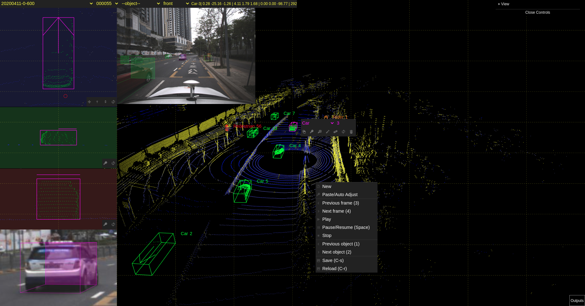
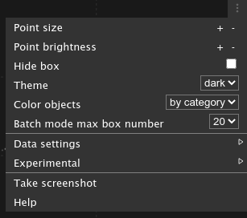
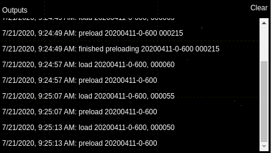
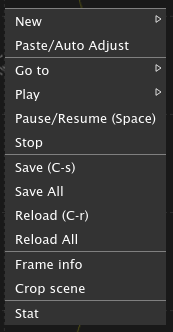
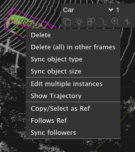
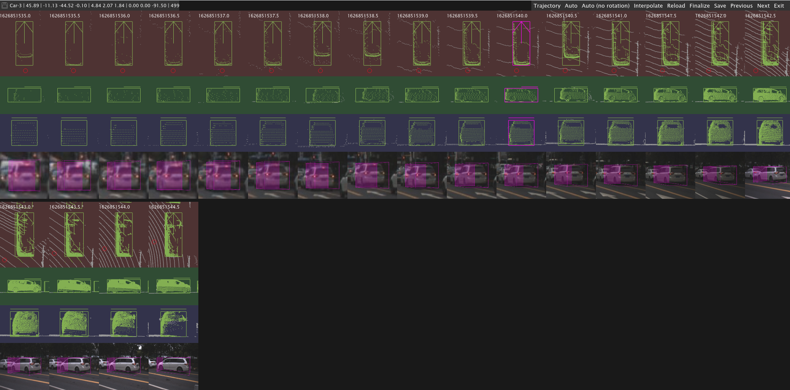

# SUSTechPOINTS: 3D Point Cloud Annotation Tool

## UI说明

### 屏幕左上区域

     Scene选择
     Frame选择
     目标id选择(试验用，会启动batchedit模式,显示该物体的多个实例)
     相机选择 在不同相机间切换,选择3dbox时也会自动切换
     Box信息
          *(表示已更改未保存) 类别-ID | x y z | 长宽高 | roll pitch yaw | 点数 |F:n(follow obj n)

### 菜单

- point size +/- 增加/减小点的大小
- point brightness +/- 增强/减弱点的亮度
- toggle background
- toggle box
- toggle obj color
- toggle id
- toggle category
- previous frame
- next frame
- take screenshot 下载屏幕截图(仅3D场景)

### 相机图片

拖动图片的右下角可以调整大小, 选择不同的相机会显示不同图片．

### 输出窗口
右下角窗口会输出运行信息, 可以点击标题栏隐藏/显示．

### 右键菜单

右键点击空白区域

- New 在鼠标当前位置创建对应的box
- Paste 在鼠标当前位置paste
- Previous frame
- Next frame
- play
- pause/resume
- stop
- previous object
- next object
- save 保存
- reload 放弃当前修改刷新上一次保存的内容

右键点击box

- delete 删除该box
- delete other instance 删除其他framｅ里该object的box
- sync object type 其它frame中该物体的类型设置为当前box的类型
- sync object size 其它frame中该物体的大小设置为当前box的类型
- inspect all instances 唤起批量标注界面
- select as ref  选择当前box为参考box (同copy)
- follows ref　设置当前box为跟随参考box(即相对位置固定)
- sync followers　将所有跟随当前box的物体标注出来．

(该菜单部分功能处于试验状态，尚不完善．)

## Operations

### 调整视角

在主窗口里可以通过鼠标左键旋转, 右键移动, 滚轮缩放视角.

### 新加Box

方法1: 鼠标移动到目标物体上, 右键选择new-物体种类, 会自动生成box并尝试自动旋转角度和调整box大小.

方法2: 按住ctrl键, 鼠标左键拉一个矩形, 会自动生成box并尝试自动旋转角度和调整box大小.

方法3: 按住shift键,鼠标左键拉一个矩形, 会生成一个box, 包含矩形框围住的点, 方向为屏幕向上的方向. 注意该操作不会自动调整box的大小和方向.

注:
- 画矩形时尽量避免将目标物体之外的点选中,可以少选.
- 上述操作方法是通过矩形投影,将范围内的点进行region grow找到目标物体所有的点. 为了避免选中太多的错误点,建议将视角旋转到接近鸟瞰视角. 
- region grow算法会受到地面的影响, 目前采用的方式是将最低的30cm部分先删除再region grow,如果地面非常倾斜,会影响效果, box生成之后需要手工调整.
- region grow算法比较慢(需要优化), 对于超大的物体如bus尽量框选完整,可以加快速度
- shift+矩形选择不会自动识别方向,为了让初始方向大致正确,建议将主视图旋转到物体的方向是沿屏幕向上或者向下,如果方向反了,按g键旋转180度.

  

### box操作

左键点击一个目标,会选中该目标物体．　选择的物体同时会在屏幕左侧显示３个投影窗口,分别是鸟瞰视图,侧视图和后视图．　如果有相机图片的话,还会显示box在图片上的投影．同时在box的旁边还会显示快速工具栏(下图)．

在快速工具栏上可以修改目标类别和tracking ID. 鼠标悬浮在工具按钮上会有相应的功能提示．

点击选中的box会激活主窗口的box调整模式,多次点击会在box大小／角度／位置３中调整模型中切换,　拖动可对box进行调整．　键盘z/x/c可以切换x/y/z轴. 使用v键也可以切换模式.

点击空白处可以取消box的编辑模式,或者取消box的选择, ESC键有同样的功能.

box被选择后, 左边的３个子窗口都可以对box进行调整．鼠标移动到某个子窗口即可在该子窗口进行调整, 调整操作方式相同, 但是各自针对不同的轴. 每个窗口可以调节2个轴的参数.

子窗口内滚动鼠标可调节显示的大小. 拉动虚线/角落可以调节box的大小和旋转角度. 双击虚线/角落/中心位置可以自动缩小box使其和点贴近. 双击旋转线会将box旋转180度.

按住Ctrl键拖动虚线, 释放鼠标会让对应的虚线自动向内侧贴近点.
按照Shift键拖动虚线有类似的效果, 但是会保持box的大小不变, 对box进行平移.

鸟瞰视图里的toolbox提供了几个常用功能的按钮:

分别是自动平移, 自动旋转, 自动旋转加缩放, 重置功能.

除鼠标和toolbox外, 还支持键盘操作.

     a: 左移
     s: 下移
     d: 右移
     w: 上移动
     q: 逆时针旋转
     e: 顺时针旋转
     r: 逆时针旋转同时自动调整box大小
     f: 顺时针选择同时自动调整box大小
     g: 反向
     t: 重置

鸟瞰图的红色圆圈表示lidar(xy平面的原点)的位置所处的方向．

侧视图和后视图提供和鸟瞰图相同的功能(自动旋转除外).

### 其他功能

     -/=: 调整点的大小
     ctrl+s  保存标注结果（暂不支持自动保存）
     del/ctrl+d  remove selected box

     1,2  选择上一个／下一个box
     3,4  切换到上一帧／下一帧
     5,6,7  显示／隐藏３个子视图的相机参数（调试功能）

     space: 暂停／继续播放

## 批量编辑

批量编辑界面可以同时对同一目标物体的多个实例(不同frame)进行编辑．　

- 激活方式1, 右键点击某box, 选择inspect all instances
- 激活方式2, 屏幕左上角窗口选择obj (试验用，不能自动切换到合适的frame)

目前一次显示20帧进行编辑．　每个子窗口的操作方式与非批量模式相同．

右上角的功能按钮如下：

     Refresh　放弃本次编辑的内容，重新加载
     Finalize　将所有自动标注的内容标记为已确认（等同于人工标注）．
     Auto　自动标注
     Interpolate　仅插值，不进行旋转和位置的调整．
     Save　保存
     Previous　前20帧(有10帧重叠)
     Next　后20帧(有10帧重叠)
     Exit　退出

说明
- 人工修改过的标注不会受到自动标注和插值的影响．finalize就是将所有的自动标注的box标记为等同人工调整过的．　标注完后需要finalize, save.
- 每个小窗口的标题是帧号,如果有M字母表示是由machine自动标注的,否则表示为人工修改过或者确认过的.
- 鼠标移动到某个小窗口, Ctrl+D可以删除box
  

## Object type configuration

如果需要修改模型的目标类型/大小/颜色,可以修改 [obj_cfg.js](src/public/js/../../../public/js/obj_cfg.js)文件.
